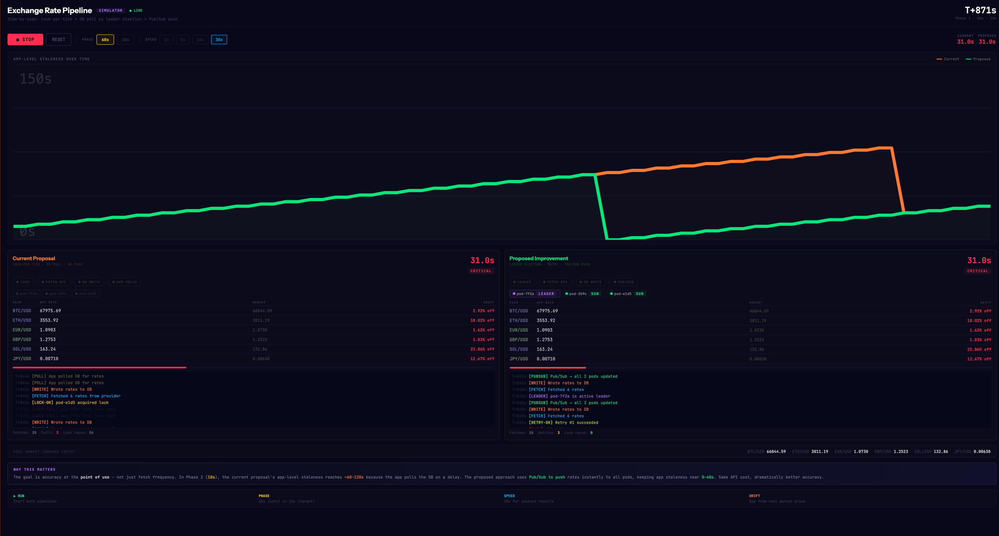

## Exchange Simulator

Here's the full simulator. Here's how to use it:
Controls:

▶ RUN — starts both pipelines simultaneously with simulated Brownian-motion market data across 6 currency pairs (BTC, ETH, SOL, EUR, GBP, JPY)
Phase 1 / Phase 2 — toggle between 60s and 10s fetch intervals mid-simulation
Speed 1x–30x — fast-forward to see patterns quickly (30x gives you results in seconds)
RESET — clear everything and start fresh

What to watch:

The staleness chart at the top is the key visual — the orange line (current) consistently spikes higher than green (proposed), especially in Phase 2
The pipeline indicators light up as each step fires: LOCK → FETCH → DB WRITE → APP POLLS (current) vs LEADER → FETCH → DB WRITE → PUB/SUB (proposed)
The drift column in the rate tables shows how far each approach's app-level prices are from real market prices at any moment
The event logs show lock contention (current has pods losing races every tick) vs clean leader execution (proposed has zero lock races)

Best demo script for stakeholders: Start at Phase 1 / 5x speed, let it run 30 seconds, then switch to Phase 2 — the gap between orange and green widens immediately, making the propagation problem impossible to miss.
